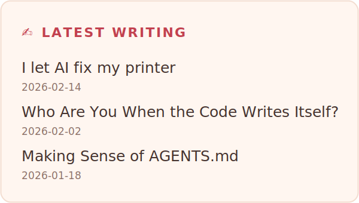
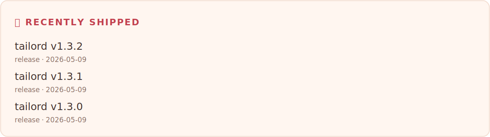
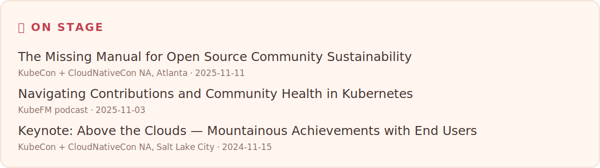
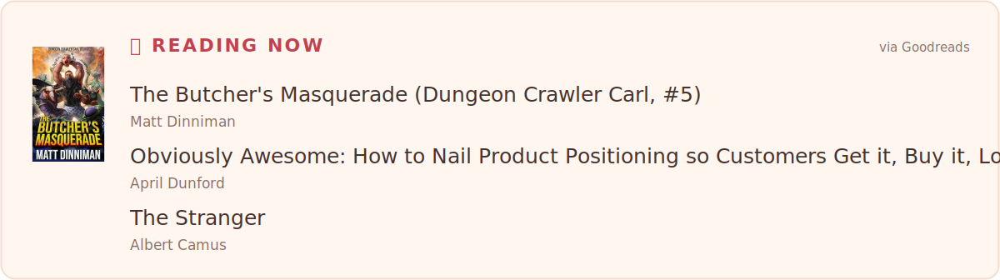

<!-- The block below is generated by generator/build.py — edit the prose
     after it, never the generated block itself. -->
<!-- bento:start -->

  <a href="https://onlydole.substack.com/p/i-let-ai-fix-my-printer"><picture><source media="(prefers-color-scheme: dark)" srcset="assets/writing-dark.svg"></picture></a>

  <a href="https://github.com/onlydole/overdue/pull/96"><picture><source media="(prefers-color-scheme: dark)" srcset="assets/shipped-dark.svg"></picture></a>

  <a href="https://youtu.be/FPQB7hQL4Vw"><picture><source media="(prefers-color-scheme: dark)" srcset="assets/stage-dark.svg"></picture></a>

  <a href="https://www.goodreads.com/review/show/8658061089?utm_medium=api&amp;utm_source=rss"><picture><source media="(prefers-color-scheme: dark)" srcset="assets/reading-dark.svg"></picture></a>

  <a href="https://onlydole.substack.com"><picture><source media="(prefers-color-scheme: dark)" srcset="assets/chip-substack-dark.svg"></picture></a>
  <a href="https://www.linkedin.com/in/onlydole"><picture><source media="(prefers-color-scheme: dark)" srcset="assets/chip-linkedin-dark.svg"></picture></a>
  <a href="https://bsky.app/profile/onlydole.dev"><picture><source media="(prefers-color-scheme: dark)" srcset="assets/chip-bluesky-dark.svg"></picture></a>
  <a href="https://onlydole.dev"><picture><source media="(prefers-color-scheme: dark)" srcset="assets/chip-website-dark.svg"></picture></a>

<!-- bento:end -->

## A little more about me

I've spent my career refactoring complex systems into intuitive platforms —
running production at Disney Studios, developer advocacy at HashiCorp,
stewarding the end user ecosystem at CNCF, and now leading open source at
[Dosu](https://dosu.dev). I care about the humans behind the code:
maintainers, newcomers, and the communities that keep this ecosystem
thriving. Reach out about Kubernetes, AI infrastructure, open source — or
the best hikes in LA.

⚡ <!-- stamp:start -->Last refreshed: 2026-07-19<!-- stamp:end --> · rebuilt daily by
[GitHub Actions](.github/workflows/build-profile.yml) ·
[how it works](generator/)
