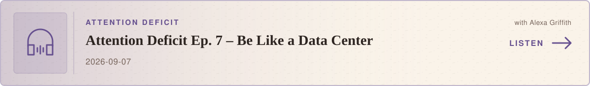

<!-- The block below is generated by generator/build.py — edit the prose
     after it, never the generated block itself. -->
<!-- bento:start -->
<a href="https://onlydole.dev"><picture><source media="(max-width: 600px)" srcset="assets/hero-mobile.svg"></picture></a>

  <a href="https://onlydole.substack.com/p/goose-open-source-agent-customization"><picture><source media="(max-width: 600px) and (prefers-color-scheme: dark)" srcset="assets/writing-mobile-dark.svg"><source media="(max-width: 600px)" srcset="assets/writing-mobile-light.svg"><source media="(prefers-color-scheme: dark)" srcset="assets/writing-dark.svg"></picture></a>

Links and full titles

<ul>
<li><a href="https://onlydole.substack.com/p/goose-open-source-agent-customization">What you can change when your agent is open source</a> · 2026-09-05</li>
<li><a href="https://onlydole.substack.com/p/i-let-ai-fix-my-printer">I let AI fix my printer</a> · 2026-02-14</li>
<li><a href="https://onlydole.substack.com/p/who-are-you-when-the-code-writes">Who Are You When the Code Writes Itself?</a> · 2026-02-02</li>
</ul>

  <a href="https://attentiondeficitpod.substack.com/p/attention-deficit-ep-7-who-let-the"><picture><source media="(max-width: 600px) and (prefers-color-scheme: dark)" srcset="assets/podcast-mobile-dark.svg"><source media="(max-width: 600px)" srcset="assets/podcast-mobile-light.svg"><source media="(prefers-color-scheme: dark)" srcset="assets/podcast-dark.svg"></picture></a>

Links and full titles

<ul>
<li><a href="https://attentiondeficitpod.substack.com/p/attention-deficit-ep-7-who-let-the">Attention Deficit Ep. 7 – Be Like a Data Center</a> · 2026-09-07</li>
<li><a href="https://attentiondeficitpod.substack.com/p/attention-deficit-ep-6-sixteen-adversarial">Attention Deficit Ep. 6 – Sixteen Adversarial Reviewers</a> · 2026-08-30</li>
<li><a href="https://attentiondeficitpod.substack.com/p/attention-deficit-ep-5-its-not-a">Attention Deficit Ep. 5 – It&#x27;s Not a Shark, It&#x27;s a Data Center</a> · 2026-08-16</li>
</ul>

  <a href="https://github.com/onlydole/onlydole.github.io/pull/15"><picture><source media="(max-width: 600px) and (prefers-color-scheme: dark)" srcset="assets/shipped-mobile-dark.svg"><source media="(max-width: 600px)" srcset="assets/shipped-mobile-light.svg"><source media="(prefers-color-scheme: dark)" srcset="assets/shipped-dark.svg"></picture></a>

Links and full titles

<ul>
<li><a href="https://github.com/onlydole/onlydole.github.io/pull/15">Point Pullfrog at deepseek-v4-pro on Ollama</a> · merged · onlydole/onlydole.github.io · 2026-08-20</li>
<li><a href="https://github.com/onlydole/overdue/pull/131">ci: raise doc-update workflow turn cap from 25 to 100</a> · merged · onlydole/overdue · 2026-08-16</li>
<li><a href="https://github.com/onlydole/overdue/pull/130">fix: repo-wide review — close XP farming and validation gaps, repair game-layer bugs, sync docs</a> · merged · onlydole/overdue · 2026-08-16</li>
</ul>

  <a href="https://creators.spotify.com/pod/profile/alexagriffith/episodes/Paying-Attention-in-the-Age-of-Agents-e3m9i24"><picture><source media="(max-width: 600px) and (prefers-color-scheme: dark)" srcset="assets/stage-mobile-dark.svg"><source media="(max-width: 600px)" srcset="assets/stage-mobile-light.svg"><source media="(prefers-color-scheme: dark)" srcset="assets/stage-dark.svg"></picture></a>

Links and full titles

<ul>
<li><a href="https://creators.spotify.com/pod/profile/alexagriffith/episodes/Paying-Attention-in-the-Age-of-Agents-e3m9i24">Paying Attention in the Age of Agents</a> · Alexa&#x27;s Input (AI), panel episode · 2026-07-20</li>
<li><a href="https://logicast.podbean.com/e/season-5-episode-16-lambdas-long-game-claudes-complexity-and-the-ai-adoption-gap/">Lambda&#x27;s Long Game, Claude&#x27;s Complexity, and the AI Adoption Gap</a> · LogiCast, Season 5 Episode 16 · 2026-04-29</li>
<li><a href="https://www.youtube.com/watch?v=h7XLE_taVN4">Shaping the Future of Documentation. OSS, Knowledge, and Dosu</a> · Software Plaza · 2025-12-05</li>
</ul>

  <a href="https://www.goodreads.com/review/show/8886300863?utm_medium=api&amp;utm_source=rss"><picture><source media="(max-width: 600px) and (prefers-color-scheme: dark)" srcset="assets/reading-mobile-dark.svg"><source media="(max-width: 600px)" srcset="assets/reading-mobile-light.svg"><source media="(prefers-color-scheme: dark)" srcset="assets/reading-dark.svg"></picture></a>

Links and full titles

<ul>
<li><a href="https://www.goodreads.com/review/show/8886300863?utm_medium=api&amp;utm_source=rss">Beyond Belief: The Science-Backed Way to Stop Limiting Yourself and Achieve Breakthrough Results</a> · Nir Eyal</li>
<li><a href="https://www.goodreads.com/review/show/8863496208?utm_medium=api&amp;utm_source=rss">All That&#x27;s Unseen: An Appalachian Memoir</a> · Emilee Hackney</li>
<li><a href="https://www.goodreads.com/review/show/8826127703?utm_medium=api&amp;utm_source=rss">You Can Just Do Things: How High-Agency People Get What They Want Out of Life</a> · Cate Hall</li>
</ul>

  <a href="https://onlydole.substack.com"><picture><source media="(prefers-color-scheme: dark)" srcset="assets/chip-substack-dark.svg"></picture></a>
  <a href="https://www.linkedin.com/in/onlydole"><picture><source media="(prefers-color-scheme: dark)" srcset="assets/chip-linkedin-dark.svg"></picture></a>
  <a href="https://bsky.app/profile/onlydole.dev"><picture><source media="(prefers-color-scheme: dark)" srcset="assets/chip-bluesky-dark.svg"></picture></a>
  <a href="https://onlydole.dev"><picture><source media="(prefers-color-scheme: dark)" srcset="assets/chip-website-dark.svg"></picture></a>

<!-- bento:end -->

## A little more about me

I lead open source at [Dosu](https://dosu.dev). Before that, I worked on
production systems at Disney Studios, developer advocacy at HashiCorp,
and the end user community at CNCF. The part I keep coming back to is
helping people find their way into a project and stick around.

I also co-host [Attention Deficit](https://attentiondeficitpod.substack.com)
with Alexa Griffith. We talk through the week's AI news and what happens
when you actually build with this stuff.

Talk to me about Kubernetes, open source, your latest side project,
or a good hike in LA.

<!-- stamp:start -->Built: 2026-09-08 · cached or unavailable: podcast<!-- stamp:end --> · refreshed every six hours by
[GitHub Actions](.github/workflows/build-profile.yml) ·
[how it works](generator/)
