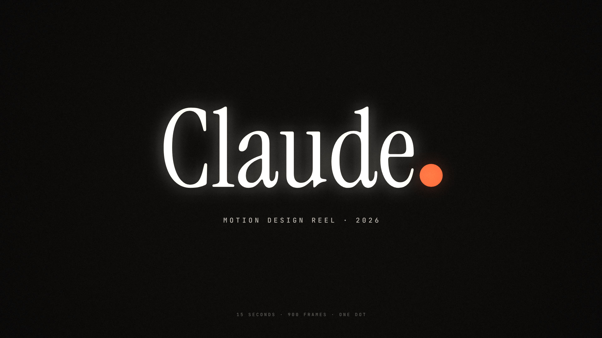

# One Dot Reel

[](showreel.mp4)

A 15-second motion design reel, written as code and rendered frame by frame.
One coral dot carries the whole piece. It bounces, turns into punctuation,
splits into a pattern, melts, goes 3D, becomes a chart, folds the reel into a
grid of itself, and finally lands as the full stop in the name on the end card.

[Watch `showreel.mp4`](showreel.mp4) (1920×1080, 60 fps, stereo AAC), or run
the live player below, which draws the same frames in real time in WebGL.

## The cut

The reel is 8 bars at 128 BPM, so 32 beats fill exactly 15 seconds. Every cut
and every sound lands on that grid.

| Beats | Chapter          | What it shows                                                                                                                     |
| ----- | ---------------- | --------------------------------------------------------------------------------------------------------------------------------- |
| 0–4   | Squash & stretch | A ball with real gravity, bounces that halve in height, an After Effects style motion path with keyframes, anticipation, release  |
| 4–8   | Kinetic type     | Three lines justified to one measure by solving for the variable font's width axis, each line animated with a different technique |
| 8–12  | Pattern          | A dot grid emanating on a distance stagger, a shock wave, then every dot reseated on a golden-angle sunflower spiral              |
| 12–16 | Liquid           | Shader metaballs with a height-field normal, so the goo shades smoothly through every split and merge                             |
| 16–20 | Dimension        | 1,400 points morphing sphere to torus to trefoil knot, depth sorted with depth of field, then flattened into a line               |
| 20–24 | Data             | Spring bars, odometer counters, a line chart that draws on and bends into a ring, then a donut                                    |
| 24–28 | Rhythm           | The reel folds into a live 2×2 grid of its own scenes, then 4×4, then an 8×8 step sequencer, then back to one dot                 |
| 28–32 | Hello            | The dot arcs over and lands as the full stop                                                                                      |

## How it is built

Everything is a pure function of time, so any frame can be rendered in any
order and several browsers can render in parallel.

- `timeline.js` holds the beat clock and every shared cue. Picture and sound
  both read from it, which is why they cannot drift.
- `type.js` draws type as vector outlines. `tools/build-glyphs.mjs` samples
  the Anybody variable font on a 3×3 grid of its width and weight axes, and
  because every instance of a variable glyph shares one point structure, the
  reel interpolates between masters to animate the axes continuously.
- `scenes.js` paints each chapter into a 2D canvas layer.
- `gl.js` composites that layer in WebGL2. Each output frame averages 8
  sub-frames across a 180° shutter in a half-float buffer, which is real
  motion blur rather than a smear. It also shades the metaballs and adds bloom,
  chromatic aberration on the hits, vignette and grain.
- `audio.js` synthesizes the soundtrack with the Web Audio API in an
  `OfflineAudioContext`: kick, clap, hats, sidechained bass and pads in A minor,
  an arpeggio, and sound design for the bounces, the bars and the line (both
  sonified from the chart's own data). It resolves to A major 9 on the name.
- `render.mjs` drives headless Chromium through Playwright, streams raw
  frames into ffmpeg, and muxes the soundtrack.

## Run it

```sh
npm install
npm run serve          # live player at http://127.0.0.1:8080
npm run render         # writes showreel.mp4 and poster.jpg
```

Rendering needs an ffmpeg build with libx264. Set `FFMPEG` if it is not on
your `PATH`, and set `CHROMIUM` to use a local Chromium instead of Playwright's
download. `node render.mjs --stills 3.4,14.2` writes single frames to
`.frames/` for checking a moment without a full render.

## Credits

Type is outlined from [Anybody](https://github.com/Etcetera-Type-Co/Anybody),
[Instrument Serif](https://github.com/Instrument/instrument-serif) and
[JetBrains Mono](https://github.com/JetBrains/JetBrainsMono), all under the
SIL Open Font License 1.1.
